 
 Most commonly used controlled rectifier for the speed control of DC machine is single phase fully controlled rectifier. The circuit diagram of fully controlled rectifier with R load and corresponding output waveform is shown in figure 1. To understand the working of this circuit, click on next button. The average DC load voltage in fully controlled rectifier is controlled by the controlling the firing angle (α) for the two transistors in per half cycle.

  <h5> For R load</h5>
  <table>
  <tr>
    <td>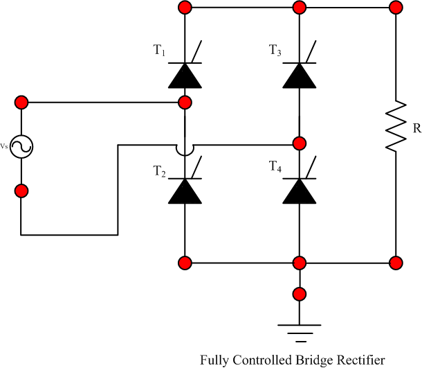</td>
  <td>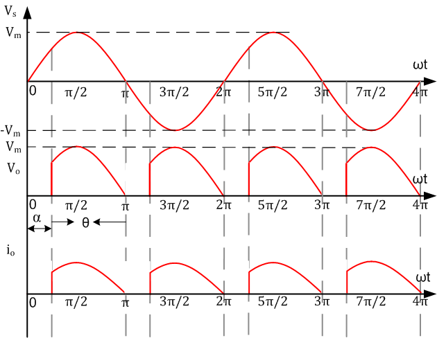</td>
  </tr>
  <tr>
    <td>
Fig. 1(a)
</td>
  <td>
Fig. 2(b)
</td>
  </tr>
  </table>
 
For positive half cycle, thyristors T1 and T4 both are fired together at an angle α and the current conduction starts in the direction Vs →T1→R→T4→Vs as shown by red line. Therefore, the output voltage is given by:

Vo = Vs 

The output voltage and output current diagram is shown in figure 2.
  <table>
  <tr>
    <td>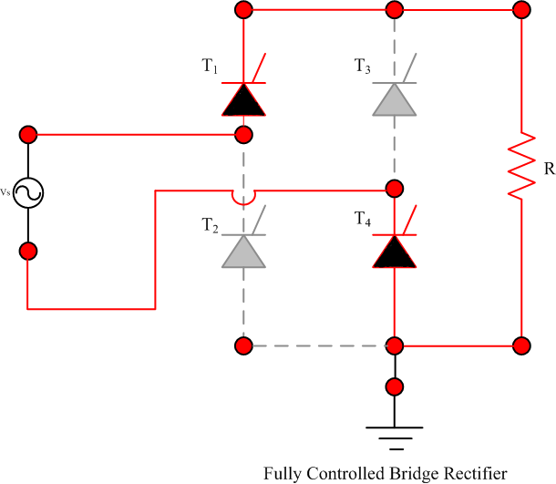</td>
  <td>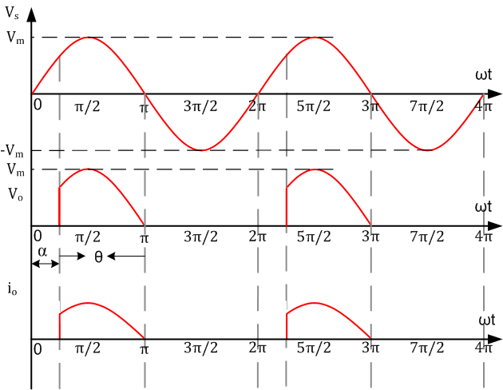</td>
  </tr>
  <tr>
    <td>
Fig. 2(a)
</td>
  <td>
Fig. 2(b)
</td>
  </tr>
  </table>
In negative half cycle, thyristors T3 and T4 both are also fired together at an angle α and current conduction starts in the direction Vs→T3→R→T2→Vs. Therefore, the output voltage is given by:

Vo = -Vs 

The output voltage and output current diagram is shown in figure 3. 
 <table>
  <tr>
    <td>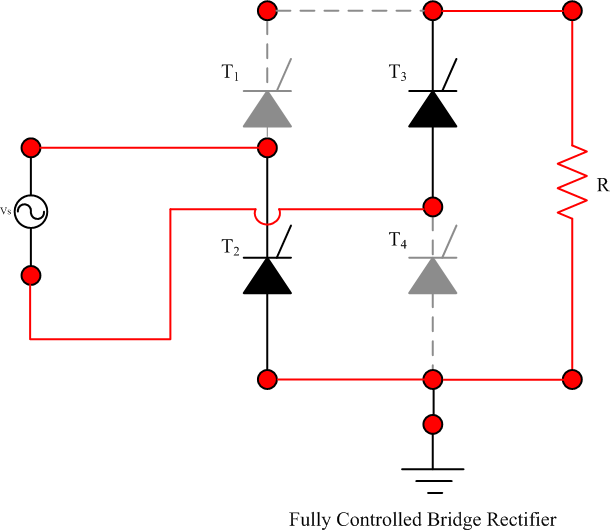</td>
  <td>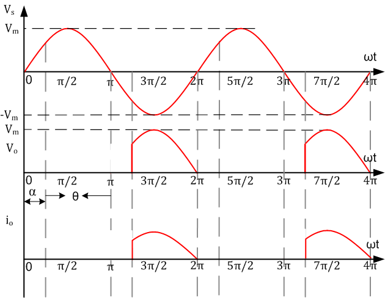</td>
  </tr>
  <tr>
    <td>
Fig. 3(a)
</td>
  <td>
Fig. 3(b)
</td>
  </tr>
  </table>
<b>The average or DC value of the load voltage is given by: </b> Vo,avg = &radic;(2)Vm/&#120587;(1+cos &prop;)                                      (1) 
 <h5> For RL load</h5>
 
 The circuit diagram of fully controlled rectifier with RL load and corresponding output waveform is shown in figure . To understand the working of this circuit, click on next button. The average DC load voltage in fully controlled rectifier is controlled by the controlling the firing angle (α) for the two transistors in per half cycle. 

 <table>
  <tr>
    <td>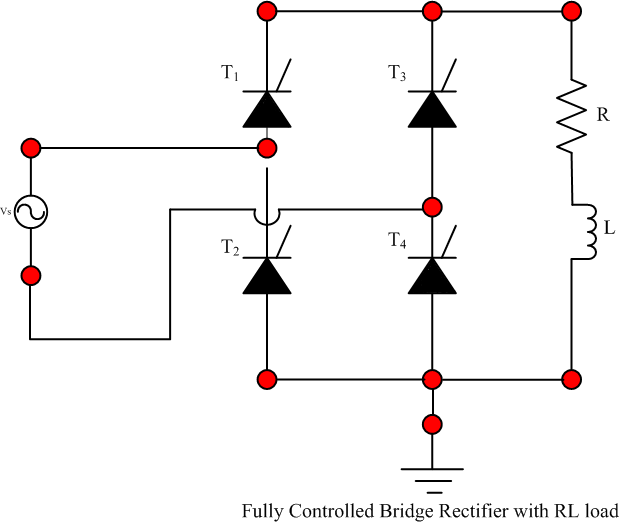</td>
  <td>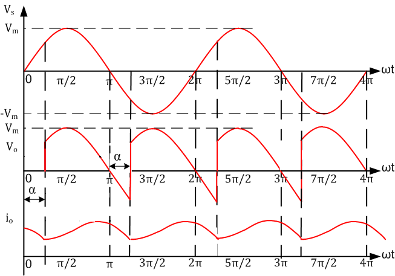</td>
  </tr>
  <tr>
    <td>
Fig. 4(a)
</td>
  <td>
Fig. 4(b)
</td>
  </tr>
  </table>

For positive half cycle, thyristors T1 and T4 both are gated at an angle α and both thyristors conduct from ωt=α to ωt=π+α. Therefore, the current conduction starts in the direction Vs →T1→R→T4→Vs as shown by red line for π radian. Therefore, the output voltage is given by:

Vo = Vs 

The output voltage and output current diagram is shown in figure 5. 
  <table>
  <tr>
    <td>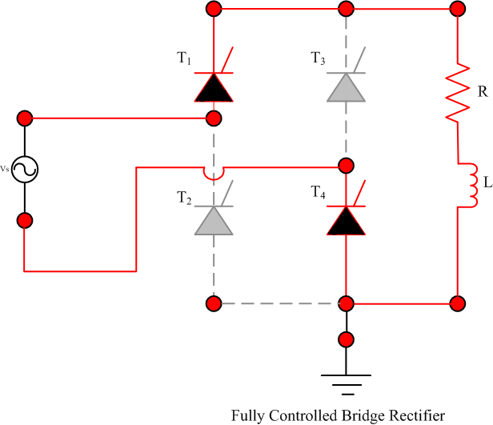</td>
  <td>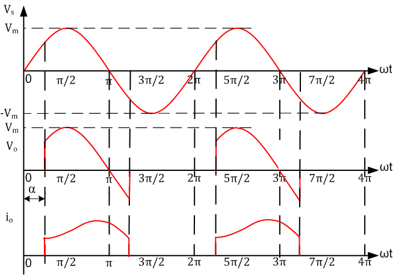</td>
  </tr>
  <tr>
    <td>
Fig. 5(a)
</td>
  <td>
Fig. 5(b)
</td>
  </tr>
  </table>

 At to ωt=π+α, thyristors T3 and T2 both which are already forward biased, are triggered together and current conduction starts in the direction Vs→T3→R→T2→Vs. The input supply voltage turns off T1and T4 by natural commutation. Therefore, the output voltage is given by:

Vo =-Vs 

The output voltage and output current diagram is shown in figure 6. 
 <table>
  <tr>
    <td>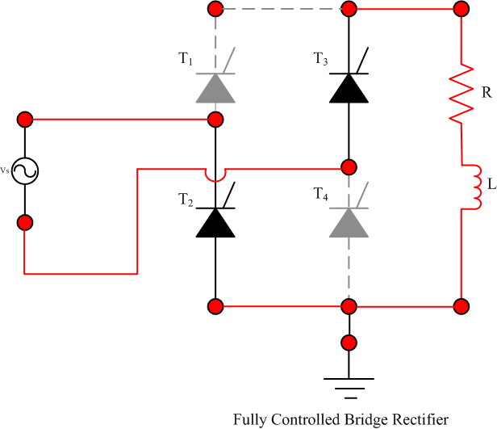</td>
  <td>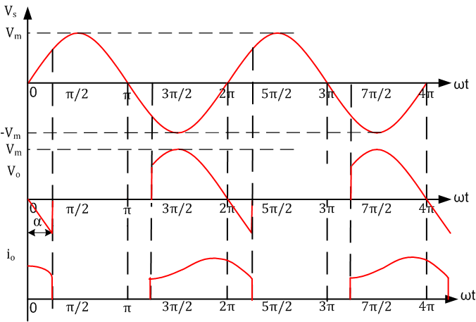</td>
  </tr>
  <tr>
    <td>
Fig. 6(a)
</td>
  <td>
Fig. 6(b)
</td>
  </tr>
  </table>
<b>The average or DC value of the load voltage is given by: </b> Vo,avg = 2Vm(cos &prop;)/&#120587;                                  (1) 

