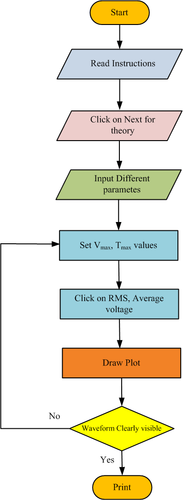
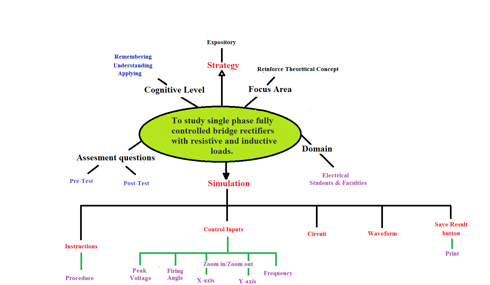
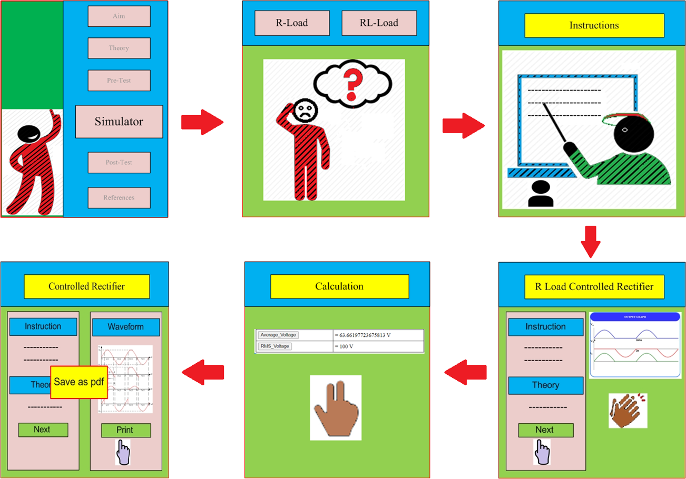

## Storyboard (Round 2)

<b>Experiment 1: To study single phase fully controlled bridge rectifiers with resistive and inductive loads.</b>

### 1. Story Outline:

The experiment is about the study of thyristor functioning to control the output rectified voltage for full wave controlled rectifier. This experiment also describes the effect of load condition on the load current waveform. The user approaches towards the simulator button to understand the role of firing angle to obtain the desired output DC value of the voltage. Further, the conducting mode of each thyristor is shown by visual effects. The first part of the simulator is designed with R load and further the second part is implemented with RL load. 

### 2. Story:

The story is started with a character called thyristor. In our daily life we learn about many things with their pros and cons. Similarly, in this experiment we learn to control the output DC voltage by delaying the ON position of the thyristor. Here thyristor acts just like a switch which is used to obtain the average output voltage according to our needs. User initiates the process to click on the simulator button. Thereafter, the study of full wave controlled rectifier is explained in a visual manner by highlighting the conducting thyristor with corresponding output waveforms.  The whole story design process of simulation experiment is narrated as a story which consists of the description of the visual stage, the goals and objectives planned and the pathway set for the learner. Moreover a few challenges and pitfalls are also set to underline and emphasize the concepts involved in the experimentation. Every stage is described thoroughly in the following subsections.

#### 2.1 Set the Visual Stage Description:

The simulator starts with the experiment name on the top and by default simulator moves on the page of full wave controlled rectifier with R load. At the top right side of the page a toggle button is there to switch the window from R load to RL load. The simulator consists of five blocks: three blocks at left side and two blocks at right side of window. The right side block consists of circuit diagram section and output waveform section. Three left side blocks are divided into 1) Instruction section: this section provides information to use the simulator. 2) Theory section: this section is related with the operating principal of full wave controlled rectifier and 3) Calculation section: this section is provided to calculate the DC voltage value of output voltage. Finally, a print button is provided to print the circuit and waveform section.
 

#### 2.2 Set User Objectives & Goals:

The main objective of this experiment is to let the user know about the functioning of thyristor and its application as half wave controlled rectifier. At the end of the module the student would be able to understand:

  1. The difference between full wave uncontrolled rectifier and full wave controlled rectifier. 
  2. The role of firing angle to control the DC value output voltage. 
  3. The effect of load inductance on the conduction of thyristor. 
  4. The effect of load inductance on different types of output waveforms. 

#### 2.3 Set the Pathway Activities:

1. Click on the simulator tab. 
2. Read the instruction to aware with use of simulator. 
3. Go to theory section and after reading theory click on next button to understand the operating principle with R load by visual effect. 
4. After completion of theory, go to calculation section and provide inputs. 
5. Enter the input values to calculate . 
6. Click on Average Voltage button. 
7. Analyse the effect of firing angle on output. 
8. Click on RL load button at the top right corner to toggle the window to  RL load page. 
9. Repeat the process 2 to 9 to study operating principle with RL load. 
10. Click on Print button to save the output. 

##### 2.4 Set Challenges and Questions/Complexity/Variations in Questions:

<b>Task 1: Understanding full wave controlled rectifier experiment</b> 
<b>Assessment Questions:</b> 
   1. Once you move on the simulator page what is the default value of peak      voltage? 
   2. What difference do you observe between current waveforms of R and RL      loads? 
   3. What result do you expect when you change the value of load                inductance? 
   4. What result do you expect when you change the value of load                resistance?  
   5. Interpret and conclude the experiment. 
   
 <b>Task 2: Simulate the full wave controlled rectifier with the               simulator. [LO1, LO2, LO3, LO4, LO5]</b> 
 
   Difficulty level: Remember 
   
 <b>1. The full wave rectifier gives output as:</b> 
        (A) A full wave similar to input supply. 
        (B) A full wave opposite to output voltage. 
     <b>(C) A full wave in one direction according to connection.</b> 
        (D) No output 
      
   Difficulty level: Understand 
      
  <b>2. The full wave controlled rectifier with firing angle 00 gives         output for</b> 
      <b>(A) Full cycle </b>
         (B) Half cycle 
         (C) No output 
         (D) Can’t say 
 
   Difficulty level: Understand 
   
 <b>3. A single phase full controlled bridge converter (B-2) uses</b> 
        (A) 6 SCRs 
     <b>(B) 4 SCRs</b> 
        (C)4 SCRs and 4 diodes 
        (D)4 SCRs and 2 diodes  
      
  Difficuty level: Apply 
  
  <b>4. A single phase full bridge inverter can operated in load
        commutation mode in case load consist of</b>            
          (A) RLC overdamped 
          (B)RL  
       <b>(C)RLC underdamped</b> 
          (D)RLC critically damped 
        
   Difficulty level: Apply 

  <b>5. A single-phase full converter is connected across an AC source of         230 V. when thyristor is fired with 30° firing angle, the average         output voltage is approximately equal to</b> 
       <b>(A)179 V</b> 
          (B)279 V 
          (C)379 V 
          (D)Given data is not sufficient 

 
##### 2.5 Allow pitfalls:
  1. User will get a message if the entered average voltage is wrong. 
  2. User will get a message if the enterd value of firing angle if greater than 90 degree. 

##### 2.6 Conclusion:
  1. The pre-test and post-test assessment must be provided immediately to the user.  
  2. The correct answer must be displayed to the user after clicking the submission button. 
  3. This would help the user to gain the basic knowledge of the experiment. 
  4. The performance feedback of user should be calculate on the basis of marks assigned to each question  

##### 2.7 Equations/formulas: NA
<b> 1.  For R Load</b> 
<b>The average or DC value of the load voltage is given by: </b> Vo,avg = &radic;(2)Vm/&#120587;(1+cos &prop;)                                      (1) 
<b> 2.  For RL Load</b> 
<b>The average or DC value of the load voltage is given by: </b> Vo,avg = 2Vm(cos &prop;)/&#120587;                                  (1) 

### 3. Flowchart 
 

### 4. Mindmap:

 
### 5. Storyboard :

